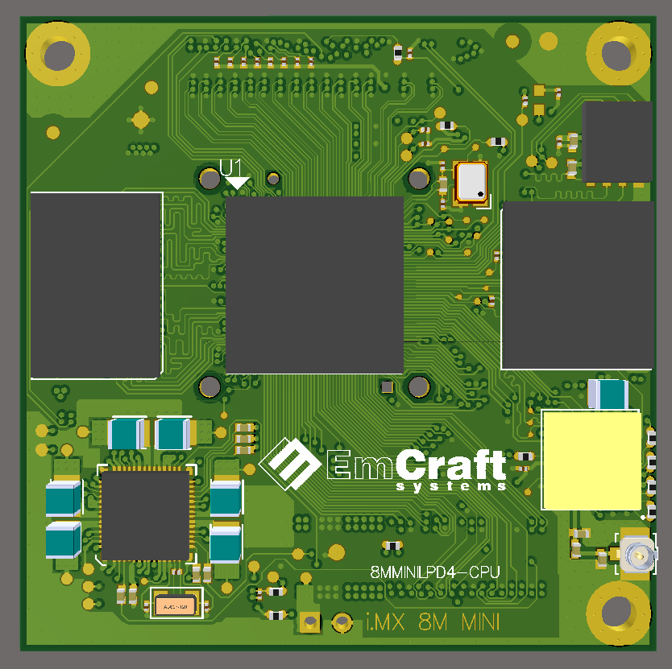
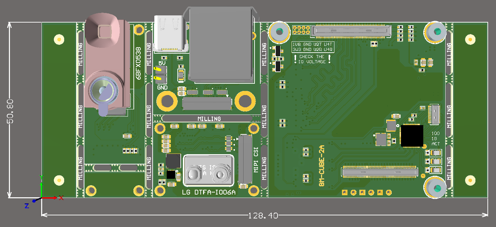

# Developer Quick Start Guide


NOTE: This information is archived and not up to date. Some information might still be useful, but continue at your own risk.


## Assembly manual

The boards ship pre-programmed, pre-assembled and configured to boot from eMMC.


While the boards ship pre-programmed with an image and configured to boot from eMMC, you will want to update to the latest code after confirming you have everything running


### Connecting the NavQ to a PC

There are several interfaces that can be used when connecting the NavQ board to a PC/laptop. The base connections are as follows below:


1. Connect the NavQ Debug UART to the USB-UART adapter (included) and then the USB-UART adapter to the PC. You can use a terminal program like Putty to connect to the root console.
2. Plug the USB C to USB A cable between the NavQ and a PC to provide power
   * [x] NOTE: The board will power up as soon as power is applied via this USB-C cable.
3. An Ethernet connection is available by using the IX Ethernet to RJ45 cable between the NavQ and a PC or Ethernet hub


IX Industrial is a new IEC 61076-3-124 standard providing rugged and compact Ethernet connections for industrial equipment. It was pioneered by Hirose and has multiple sources.


## Initial powering on&#x20;

On a factory fresh system, when power is applied using the USB-C cable (or one of the other power inputs), the system will boot to the Linux prompt. This test shows that the system is functional (UBoot and Linux in terms of the software, UART, Ethernet and eMMC in terms of the hardware).

* The default login is **root** with no password.&#x20;

##

To provide the better understanding we may suggest to refer to the tree of the system:

* &#x20;The SOM - the top layer in the assembly consist of:
  * The processor itself: can be assembled with IMX8M MINI / IMX8M NANO
  * The FLASH (eMMC): can be assembled in the range from 4GB up to 512 GBytes
  * The _first_ option for the RAM (LPDDR4): can be assembled in the range from 1GB up to 4GB, the data bus is 32 bit (high throughput)
  * The _second_ option for the RAM (DDR4): can be assembled in the range from 256MB up to 1GB, the data bus is 16 bit (medium throughput)
  * &#x20;The WiFi  **\[optional]**
* &#x20;The MEDIA board - the middle board in the stack, can provide the connectivity as follows**:**
  * The MIPI DSI (Display Serial Interface) interface at a flex connector can be used with:
    * &#x20;MIPI Display adapter board (with a 5.5 inch FullHD display) **\[optional, via 24pin flex cable]**
    * &#x20;MIPI to HDMI adapter board (HDMI at the output) **\[optional, via 24pin flex cable**]
  * The MIPI CSI (Camera Serial Interface) interface at a flex connector can be used with:
    * &#x20;Time Of Flight Camera Adapter board (38kPix) **\[optional, via 24pin flex cable**]
    * &#x20;RGB Camera Adapter board (Google Coral camera, 5MPix) **\[optional, via 24pin flex cable**]
  * The PCIe interface at a flex connector can be used with:
    * PCIe extension board with a PCIe M.2 key E adapter board (any NVMe SSD)
  * The 1G Ethernet PHY which can be connected to the:
    * Ethernet+USB adapter board  **\[optional, via 24pin flex cable**]
    * HGI board  **\[optional, via board-to-board connector**]
  * The microSD card holder
  * The USB 2.0 interface (USB0) with the optional connectivity to the:
    * &#x20;Ethernet+USB adapter board  **\[optional, via 24pin flex cable**]
    * &#x20;HGI board **\[optional, via board-to-board connector**]
* &#x20;The HGI (HoverGamesInterposer), can provide the connectivity as follows**: \[Optional]**
  * The USB 2.0 interface (USB0) (available at USB type-C connector)
  * The USB 2.0 interface (USB1) (available at micro-USB connector)
  * The 1G Ethernet connector (IX industrial Ethernet connector)
  * The JTAG interface (for debugging purposes)
  * The BootMode switches (to switch between USB/eMMC/SD card)
  * The RGB LED (for some fun for HoverGames)
  * The UART interfaces (2 pcs)
  * The SPI interfaces (1 pcs)
  * &#x20;The secure element (an IC for HG games)

The actual kit consist of all the three layers (SOM + Media board + HoverGames Interposer Board) with the Google Coral camera installed by default ([https://coral.ai/products/camera/](https://coral.ai/products/camera/))

Each layer implemented as an individual project and has it's own documentation (schematic + layout)

Here you can find the schematics and renders for each board in the stack:




IMX8MM-SOM-1A. 32-bit LPDDR4, Murata 1PJ WiFi, Full IO at 3V3





MEDIA BOARD. Engineering Sample ()


.png>)


Hover Games Interposer. Engineering sample.



Please note, in accordance with the **manufacturer** recommendations, the flex cable connectors designed for 20 mating cycles only, the board-to-board connectors designed for 30 mating cycles only.&#x20;

For development purposes, our own experience shows that the board-to-board connectors can in practice withstand up to 500 mating cycles. However this is beyond specification and for critical application use it is best to minimize mating cycles and stress to the connectors.


## Engineering Sample boards


Pre-production hardware marked as "engineering samples" have the following known issues and limitations:

* The SD Card Detect has been permanently tied to ground (which is a signal of permanent presence of an SD card.)
* The 1G Ethernet may be unstable with some Ethernet hubs and/or end-point devices

These issues will be resolved in the next revision.


## Boot Mode and Config Switches

* Engineering sample boards nevertheless are suitable for debugging all the other interfaces and capabilities.

### Boot mode Table

In order to switch the board into the various i.MX debugging modes you may refer to the table below which describes the boot modes available at the board.&#x20;


The 8mmNavQ ships with an **8M Mini** SOM in the board stack **not the 8M Nano**. \
(Portions of this board stack can be re-purposed and used with the 8M Nano. Contact emCraft for details)



.png>)

.png>)

* An X means that the position of the switch does not matter
* A dark square shows the position of the movable element on the switch.

### Boot from USB&#x20;

To configure boot access to the system via USB please set the boot mode switches in accordance with the table above for "8M MINI: boot from USB" configuration. After power cycling the board the processor will power on and become available via USB-C connector. It will not execute code form the onboard SDCARD or eMMC.

Any regular tests and operations are now available via the UUU tool. The DDR Stress Test tool is also could be used in order to perform the LPDDR4 calibration.

### NavQ UBoot and LPDDR4 - Engineering Samples&#x20;

This particular system is built with 3GBytes of RAM, which means the default UBoot configuration and the lpddr4\_timing.c file should be updated. The patch provided below has been applied to the UBoot tree available at:

* [https://source.codeaurora.org/external/imx/uboot-imx.git](https://source.codeaurora.org/external/imx/uboot-imx.git) -b refs/heads/imx\_v2018.03\_4.14.98\_2.0.0\_ga



Also, you may use the LPDDR4 calibration file only:



####

#### Building U-Boot from Scratch

The detailed manual how to build U-Boot from the scratch is described at: [https://community.nxp.com/docs/DOC-345535](https://community.nxp.com/docs/DOC-345535)

The U-Boot image may be re-built using the manual and patch above. This will allow you to boot the system via USB using the [NXP **UUU tool**](https://community.nxp.com/docs/DOC-344579) **** and program U-Boot to the eMMC using the UUU script below:

```
uuu_version 1.0.1

# for IMX8MQ, IMX8MM
SDP: boot -f flash.bin
SDPV: delay 1000
SDPV: write -f flash.bin -skipspl
SDPV: jump

# Configure U-Boot variables
FB: ucmd setenv fastboot_dev mmc

# Flash the MMC image
FB: ucmd mmc dev 1
FB: ucmd setenv mmcdev 1

FB: flash bootloader flash.bin

FB: ucmd mmc partconf 1 0 1 1
FB: ucmd mmc bootbus 1 1 0 2

FB: Done
```

#### Switch back to eMMC mode

After successfully reaching this point you may switch back from "Boot from USB" mode to "boot from eMMC" mode.

### Building Linux

In order to build Linux you may refer to the git available at

* [https://source.codeaurora.org/external/imx/linux-imx.git
  \
  ](https://source.codeaurora.org/external/imx/linux-imx.git)-b refs/heads/imx\_4.14.98\_2.0.0\_ga


INITIAL DEVELOPERS ONLY - NOTE: The patch below for the tree is extremely raw and should be used as a reference only





* In order to get the root file system please refer to the Yocto reference manual, chapter 5.
* This is an initial version of the manual and the coverage of all the aspects is quite limited. If you would face any HW issues, please let me know via email **abushuev@emcraft.com** and/or via NXP's Microsoft Teams' messaging system.
* Contact NXP at **iain.galloway@nxp.com** for coordination or other questions.
