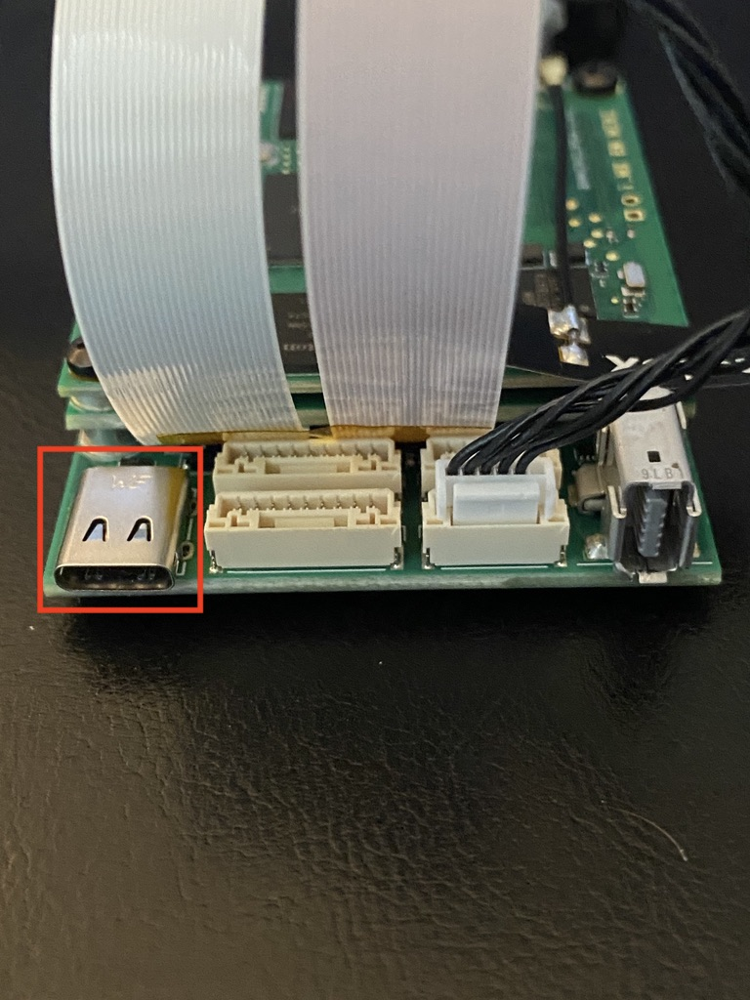

# Quick start Guide

## Getting started with your NavQ kit

The NavQ is a device that will allow you to add extra compute to your HoverGames drone system. With an i.MX 8M Mini processor, you will be able to reach new boundaries of vision and sensor data processing.

## Current Demo build version

The current Demo build was built on 7/24/2020. Confirm you are on the correct image by running `uname -a`. You should get the following output:

```text
Linux imx8mmnavq 5.4.24-2.1.0+gbabac008e5cf #1 SMP PREEMPT Fri Jul 24 23:17:18 UTC 2020 aarch64 aarch64 aarch
```

## Notice about SD Card Slot


The SD Card slot on the NavQ is sandwiched between the Media Board and the HoverGames Interposer Board. There are several important components underneath the SD card slot. We highly recommend that you be very careful when using the SD card slot so the components are not damaged. One notable component is the USB controller - it is quite small, so if it gets damaged, you won't be able to use USB devices over the MicroUSB port. One way to be safe when inserting or removing the SD card is by using some tweezers as seen in the image below.



## Default username/password for the Demo image

The SD card included in the NavQ kit is preloaded with our HoverGames-Demo Linux distribution. The default username and password are:

### Username: navq Password: navq

## Powering the NavQ

To power your NavQ, there are two options. The first is to use one of the included USB-C cables and connect it to a USB port on your computer.



The other option is to power it through one of the included connectors in your NavQ kit. These connectors plug into the 5-pin POWER port next to the boot switches on your NavQ. You may use the barrel connectors or the XT60 power breakout connector. Some images and more details can be found here:



## Accessing the serial console

To access the serial console on your NavQ, attach one of the included USB-C cables to the USB-&gt;UART adapter included in your kit. You can use programs such as PuTTY to access the serial console. A full guide to do this is linked below.



## Expanding the SD card

When your board arrives, the Demo image will already be loaded to the SD card. This image does not take up the full amount of space on the SD card, so you'll need to expand the space in order to install more packages such as ROS or OpenCV. Follow the guide here to do so:



## Mounting your NavQ to the HoverGames Drone

Follow the guide linked below to mount your NavQ to your drone:



## Using your NavQ as a desktop computer

Depending on which Linux distribution is loaded, you may find that the NavQ includes a desktop application. This may be a minimal desktop with only a terminal emulator or it may be more feature rich like Liri Desktop. 


Liri Desktop is not yet supported. Currently we only have a basic Wayland desktop with a terminal. You can run GUI applications through the terminal. Try installing firefox with apt and run it!


### MIPI-DSI to HDMI adapter

The signaling is output on the MIPI-DSI port and if a compatible LCD panel is attached, then it would be visible there. Most of us will have access to a standard HDMI monitor, and there is a MIPI-DSI to HDMI adapter included in the kit also.  

### Connecting a mouse and keyboard

In order to connect both a mouse and keyboard to the NavQ you will need to connect the included microUSB to USB-A hub.  Other USB peripherals may also be supported but need to be tested as it is not guaranteed that all USB drivers will be available.

## Recording a video with NavQ

### GStreamer

You can use GStreamer to take 1080p 30fps video. This uses the included H264 encoding plugin for i.MX 8M Mini. Here's an example pipeline you can run on your NavQ to take video:

```text
$ sudo gst-launch-1.0 v4l2src ! vpuenc_h264 ! avimux ! filesink location='video.avi'
```

When you want to end the video, just press Ctrl+C to cancel the pipeline, and the file should be saved to the present directory.

### OpenCV

To record video with your NavQ, you can run this simple python script that uses OpenCV to write video to a file:



This is a simple example that you can use as a starting point for even bigger things with OpenCV/computer vision! If you'd like a more sophisticated guide that runs through example code to detect red objects, head to the [developer guide on OpenCV](../../navq-developer-guide/software-support/opencv.md) to find more.

## Controlling HoverGames drone with NavQ

To perform off-board control of the HoverGames drone from the NavQ, you'll need to get a little bit involved with ROS + MAVLink \(MAVROS\). To see a guide on how to get started, head over to the [developer guide](../../navq-developer-guide/software-support/untitled/)!

## Connecting to WiFi

A package named `connman` is included in the image to help you connect to WiFi through the command line. To connect to WiFi, run the following commands:

```text
$ connmanctl
connmanctl> enable wifi
connmanctl> scan wifi
connmanctl> services

WIFI_SSID     wifi_e8de27077de3_41483034303434393134_managed_psk

connmanctl> agent on
connmanctl> connect wifi_e8de27077de3_41483034303434393134_managed_psk
<enter passphrase>
<wait for connection success message>
connmanctl> exit
$ ping www.nxp.com
```


When you run `services`, there may be duplicates of each WiFi network. We reccomend you use the first one, there have been issues connecting after reboot with the second one.


Your NavQ should automatically connect to WiFi when rebooted. If you want to connect to another WiFi network, just go through the same process again.

## Transferring files to and from NavQ over FTP

If you need to transfer files to and from the NavQ over a wired or wireless connection, you can use FileZilla to access the NavQ's FTP server. First, you'll want to connect the NavQ to your local network \(WiFi or Ethernet\) and run `ifconfig` to find the IP address that was assigned to your NavQ. Then, use FileZilla to connect to that IP with the username `navq` and password `navq`. 

A guide on how to use FileZilla is here:



## Next steps

Now that you've gone through the Quick Start Guide, you can move on to the Developer Guide if you'd like to go more in depth. Use the sidebar on this Gitbook to navigate to the next section.

