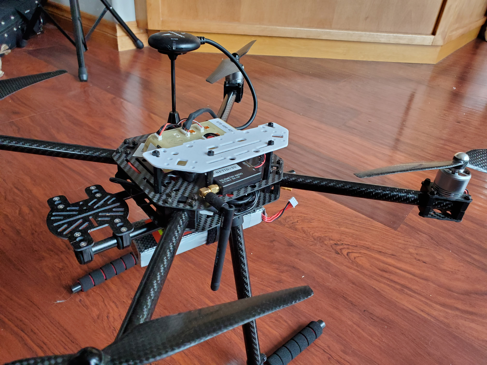
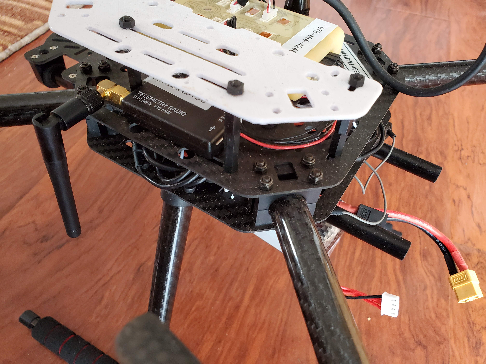
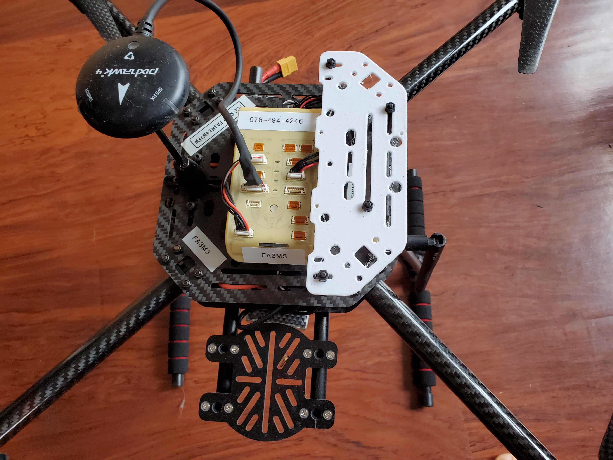
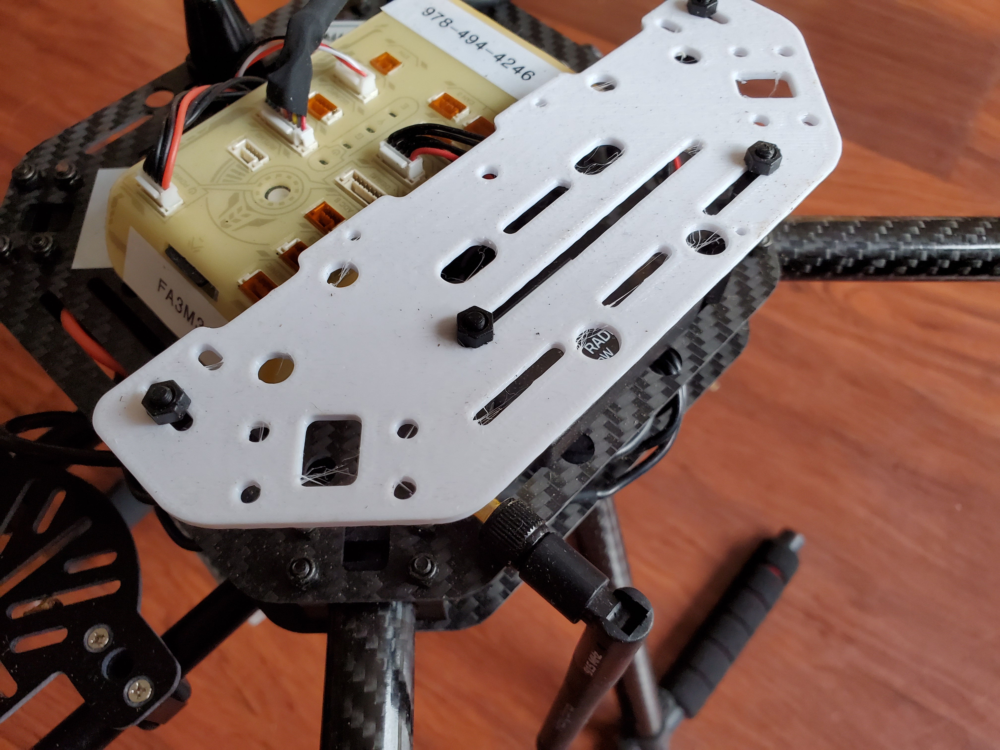
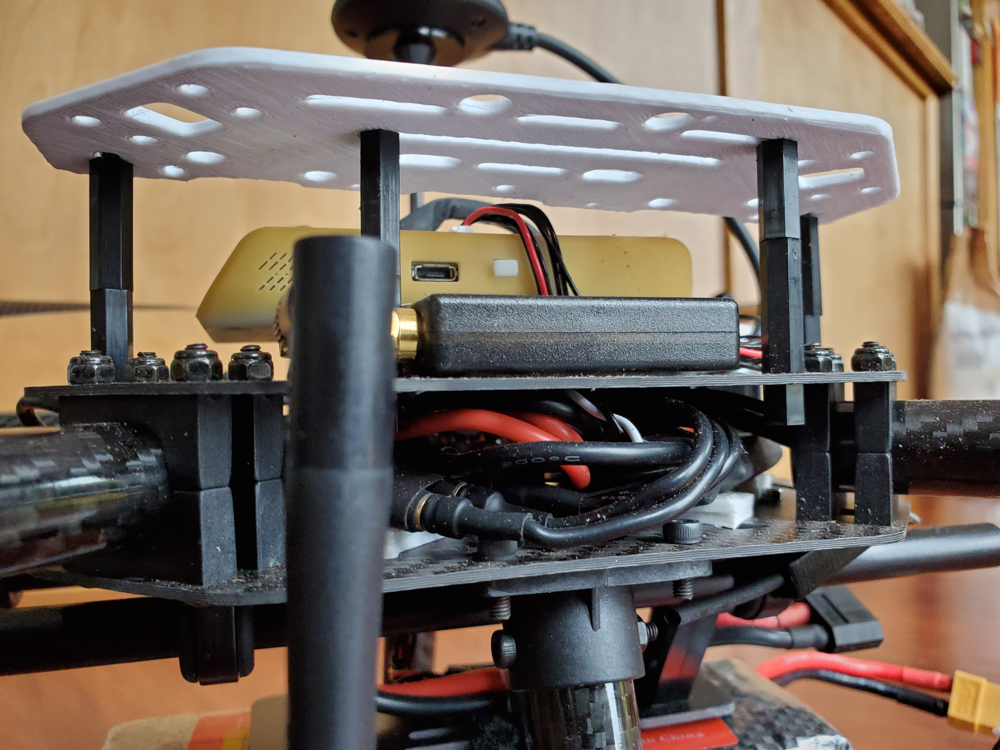

# Mounting NavQ on HoverGames Drone

The suggested method of mounting the NavQ to the Drone frame is shown below. Improvements and suggestions are welcomed. Please message on community.nxp.com here: [https://community.nxp.com/community/mobilerobotics/hovergames-drone-challenge](https://community.nxp.com/community/mobilerobotics/hovergames-drone-challenge)


Use two of the Hex standoffs together to make ~35mm total standoff height between the top plate and the NavQ mounting plate



The NavQ can mount to the small carbon fiber plate using screws, standoffs or double sided tape. 



We did allow for mounting the NavQ with screws, HOWEVER one of the three mounting holes did not get drilled. Please drill the third hole by hand if you wish to mount with screws. Alternatively you can use two screws and some double sided tape for the missing screws. You should use tape or a 3rd hole, because otherwise the board will vibrate too much.



Note the use of short hex standoffs instead of nuts under the main top-plate because they are easier to hold with needle nose pliers without needing to disassembe the complete frame.



One modification tried was to add a second standoff "hanging" from the front so that the camera module could stick between these two front standoffs to with double sided tape.


