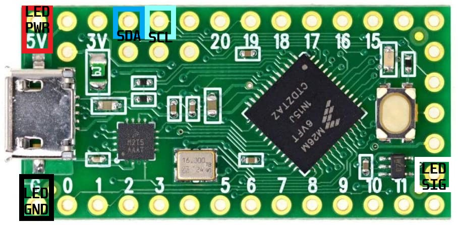
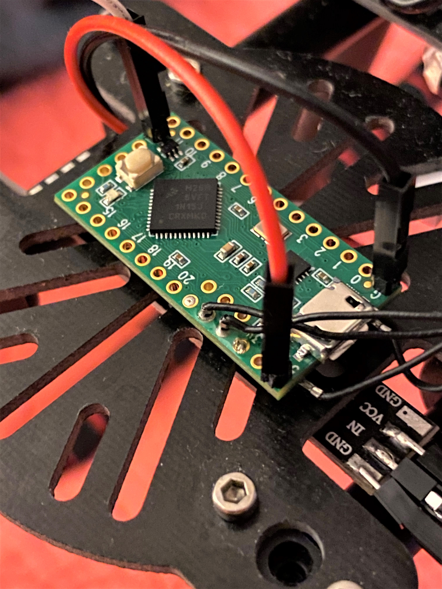
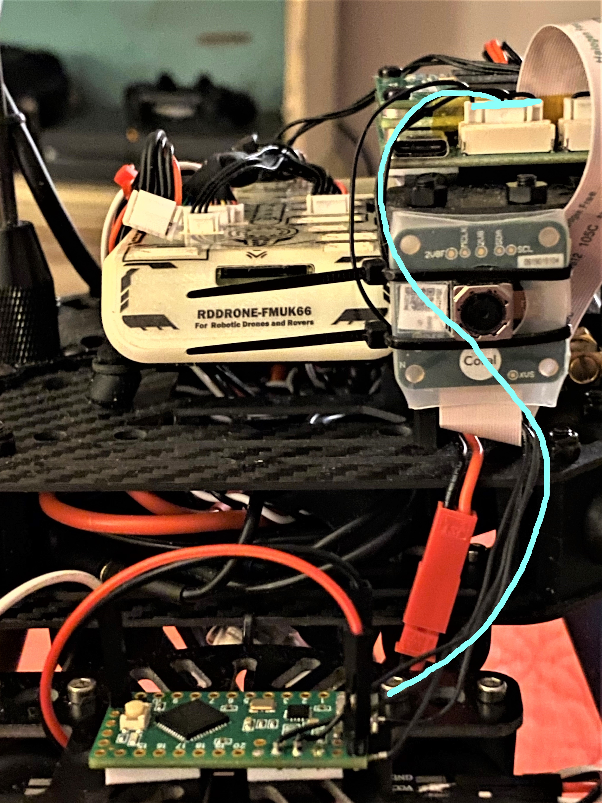

# I2C

## I2C Example

The NavQ includes an I2C port in one of the JST-GH connectors. You may use this port to communicate to other devices in your drone system. In this example, we will go over the process of connecting a Teensy LC to the NavQ over I2C to control some WS2812 LEDs.

### TODO

1. Add guide for using C/Python SMBus libraries for controlling I2C
2. Add more pictures/visuals
3. Explain teensy code
4. etc

## Prerequisites

### Hardware

1. Teensy LC
2. NeoPixel LED Strip \(Ex. [https://www.amazon.com/WS2812-Channel-Color-Driven-Development-Arduino/dp/B081BBF4R3/ref=sr\_1\_48?dchild=1&keywords=neopixel+led+strip&qid=1599144002&sr=8-48](https://www.amazon.com/WS2812-Channel-Color-Driven-Development-Arduino/dp/B081BBF4R3/ref=sr_1_48?dchild=1&keywords=neopixel+led+strip&qid=1599144002&sr=8-48)\)
3. JST-GH connectors and pre-terminated wires
4. Headers
5. Soldering kit

### Software

1. Teensy side
   1. Arduino IDE
   2. TeensyDuino
2. NavQ side
   1. i2c-tools \(installable from apt\)

## Preparing the JST-GH connector

To create the I2C connector, you'll need to order some JST-GH hardware. Here is a link to a digikey page where you can purchase connectors: 



And here is a page where you can purchase the jumpers: 




NOTE: For the I2C connector, you'll need the 9-pin JST-GH connector.


In the hardware overview \(link here: [Hardware Overview](../../../hardware-overview/)\), you can see the pinout for the I2C connector. Here is another screenshot of it:  


The 5VP pin is on the left-most side of the connector, and GND is on the right-most side. I2C2\_SDA is pin 4, and I2C2\_SCL is pin 5. The JST-GH connector is positioned with the retention clip facing away from you when you are determining the left/right sides.

## Wiring the Teensy

You'll need to do some soldering for the first step in this project. In the two pictures below, the NeoPixels are connected to the LED 5V, LED GND, and LED SIG pins. The JST-GH connector to the NavQ connects to the SDA/SCL pins and 5V + GND pads on the back of the Teensy.  





Tip: you can solder the pre-terminated JST-GH wires directly to the pads and the through-hole pins to make things easier.


One thing to keep in mind is that even though the Teensy LC does not include pullup resistors to 3.3v for the I2C lines, pullups are not required since the NavQ has internal 4.7k pullups on it's own I2C bus \(on the SoM\).

### Pictures

Here are a couples images of this setup:





## Teensy code

We have written some simple example code that changes the color of the NeoPixel LEDs when the Teensy recieves I2C data. In the example below, the slave address of the Teensy is 0x29, and the color of the LEDs change from green to white when a 0x1 byte is sent to the Teensy. If any other byte is sent to the Teensy, the color changes back to green.


Make sure that you install the Adafruit\_NeoPixel library in the Arduino IDE.



The i2c\_t3 library is included with the TeensyDuino software. Make sure to use "Wire1" instead of "Wire" since we are using the SDA1/SCLK1 pins on the Teensy.


```text
#include <Adafruit_NeoPixel.h>
#include <i2c_t3.h>

// MACROS
#ifdef __AVR__
  #include <avr/power.h>
#endif
#define PIN       17
#define NUMPIXELS 8
#define DELAYVAL 50

#define SLAVE_ADDRESS 0x29

// INIT PIXELS
Adafruit_NeoPixel pixels(NUMPIXELS, PIN, NEO_GRB + NEO_KHZ800);
void receiveEvent(size_t bytes);
void requestEvent(void);

// MEMORY
#define MEM_LEN 256
char databuf[MEM_LEN];
volatile uint8_t received;

// INIT VARS
bool latch = false;
bool color = false;

// SETUP I2C AND PIXELS
void setup() 
{
  Wire1.begin(I2C_SLAVE, 0x29, I2C_PINS_22_23, I2C_PULLUP_EXT, 400000);
  received = 0;
  memset(databuf, 0, sizeof(databuf));
  Wire1.onReceive(receiveEvent);
  Wire1.onRequest(requestEvent);
  Serial.begin(9600);
#if defined(__AVR_ATtiny85__) && (F_CPU == 16000000)
  clock_prescale_set(clock_div_1)
#endif
  pixels.begin();
}

// LOOP
void loop() 
{
  latch = !latch;
  for(int i=0; i<NUMPIXELS; i++) 
  {
    if(color)
    {
      if(latch)
        pixels.setPixelColor(i, pixels.Color(5,5,5));
      else
        pixels.setPixelColor(i, pixels.Color(15,15,15));
    }
    else
    {
      if(latch)
        pixels.setPixelColor(i, pixels.Color(0,5,0));
      else
        pixels.setPixelColor(i, pixels.Color(0,15,0));
    }

    pixels.show();
    delay(DELAYVAL);
    //Serial.println("loop..");
  }
}

// I2C DATA RECV CALLBACK
void receiveEvent(size_t bytes)
{
  Wire1.read(databuf, bytes);
  if(databuf[0] == 1) color = true;
  else color = false;
  Serial.println(databuf[0]);
  received = bytes;
  Serial.println("recv");
}

void requestEvent(void)
{
  Wire1.write(databuf, MEM_LEN);
  Serial.println("req..");
}
```

## NavQ commands

### Add navq user to i2c group

To use the i2c commands without root, you'll need to add the navq user to the i2c group. To do this, you can run the following command:

```text
$ sudo usermod -aG i2c $USER
$ sudo su
$ echo 'KERNEL=="i2c-[0-9]*", GROUP="i2c"' >> /etc/udev/rules.d/10-local_i2c_group.rules
```

### Checking connection

Once your Teensy is connected using the I2C JST-GH connector, you need to confirm that the NavQ recognizes the Teensy as an I2C device. To do this, you can run the following command on the NavQ:

```text
$ i2cdetect -y 1
```

You should see a device at address 0x29. If there is no device at address 0x29, you'll need to check your wiring.

### Sending data to the Teensy

To send data to the Teensy, you can use the following command:

```text
$ i2cset -y 1 0x29 0x1
```

This will change the LEDs to white. You can swap the 0x1 with a 0x0 or any other byte to switch back to green.

## Controlling I2C bus with Python/C

Controlling the I2C bus with console commands is great, but what about when we want to integrate those commands into code? Well, with Python and C, we can control the Teensy over I2C by using some libraries supplied in both the Linux kernel and through pip.

### Python

First, you'll need to install the `smbus` pip package. To do this, just run in your terminal:

```text
$ pip3 install smbus
```

Once that is installed, you can run a simple script to select a 1 or 0 to send to the NavQ to change the color of the LEDs.

```text
from smbus import SMBus

addr = 0x29
bus = SMBus(1)

numb = 1

print("Enter 1 for WHITE or 0 for GREEN")
while(numb == 1):
    ledstate = input(">>>>   ")

    if(ledstate == "1"):
        bus.write_byte(addr, 0x1)
    elif(ledstate == "0"):
        bus.write_byte(addr, 0x0)
    else:
        numb = 0
```

The expected output of this script is as follows:

```text
navq@imx8mmnavq:~$ python3 i2c.py
Enter 1 for WHITE or 0 for GREEN
>>>>   1
>>>>   0
```

By selecting 1 or 0, you can change the color of the LEDs to white or green.

### C

To control the I2C bus with C, you can use the following code:

```text
#include <linux/i2c-dev.h>
#include <string.h>
#include <stdio.h>
#include <stdlib.h>
#include <unistd.h>
#include <sys/ioctl.h>
#include <sys/types.h>
#include <fcntl.h>

int main() {
        // Init vars - file descriptor and I2C slave address
        int file;
        int addr = 0x29;
        char filename[20];

        // Open the /dev/i2c-1 device filename and apply the address using ioctl
        sprintf(filename, "/dev/i2c-1");
        file = open(filename, O_RDWR);
        if(file < 0) {
                printf("Failed to open the i2c bus");
                exit(1);
        }
        if(ioctl(file, I2C_SLAVE, addr) < 0) {
                printf("Failed to acquire bus access and/or talk to slave.\n");
                exit(1);
        }
        
        // Create a data buffer, then ask the user for a 0 or 1 to change LED color
        // LED color is changed by writing buf to file
        char buf[10] = {0};
        buf[0] = 0x0;
        while(1==1){
                printf("Enter a 0 for GREEN and a 1 for WHITE: ");
                scanf("%X", &buf[0]);
                if(write(file,buf,1) != 1) {
                        printf("Failed to write to the i2c bus.\n");
                }
                printf("\n");
        }
}

```

