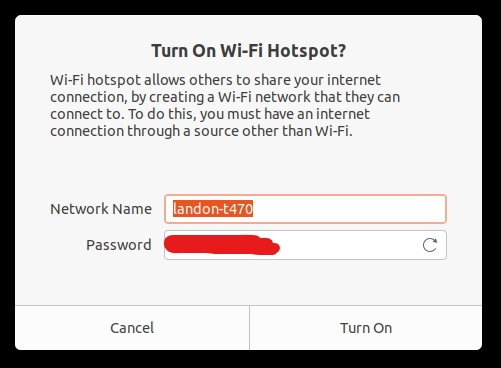

# Ad-Hoc Streaming using Mobile Hotspot

## Configuring Windows

### Step 1 - Enable Mobile Hotspot


You must have a WiFi adapter in your Laptop/PC to follow this guide.


To enable Mobile Hotspot on Windows, go to Settings-&gt;Network & Internet-&gt;Mobile Hotspot. Next, you'll want to edit your mobile hotspot settings to set a password and SSID. Once you've done this, you can enable Mobile Hotspot. You can see a full configuration in the screenshot below.


### Step 2 - Enable Port 5000/5600 in Firewall

By default, port 5000 or port 5600 is not open in the Windows firewall, so any UDP stream packets will be blocked. To enable this, go to your Windows search bar, and type "Firewall". Select "Windows Defender Firewall".


Once you open Windows Defender Firewall, you'll want to navigate to "Advanced Settings" from the menu on the left.


You will then be brought to a new window with Windows Firewall rules. To create a new rule for QGC streaming, you'll need to click "New Rule" on the right side.


You will be brought to a new window to add a rule. Select "Program" and click "Next".


At the next window, it will ask you to specify the program you are adding a rule for. Paste the following into that field and click "Next":

```text
%ProgramFiles%\QGroundControl\QGroundControl.exe
```


Once you've done this, you can click "Next" through the rest of the fields and you should be good to go.


On the page that tells you to name your rule, just name it "QGroundControl".


### Step 3 - Connect NavQ to new Mobile Hotspot

To connect your NavQ to your new Mobile Hotspot, follow the connecting to WiFi guide in the Gitbook here:



### Step 4 - Stream to QGroundControl

Now you can stream to QGroundControl as you normally would. Follow the guide here:



## Configuring Ubuntu

### Step 1 - Enable Wifi Hotspot

To enable a WiFi hotspot in Ubuntu 20.04, you'll first need to go to Settings-&gt;WiFi. Then, at the top right, click the 3 dots button and select "Turn On Wi-Fi Hotspot...".


After you click that entry, this window will pop up. Enter a network name and password, and you should be good to go! Follow Steps 3 and 4 in the Windows section above to configure your NavQ.



